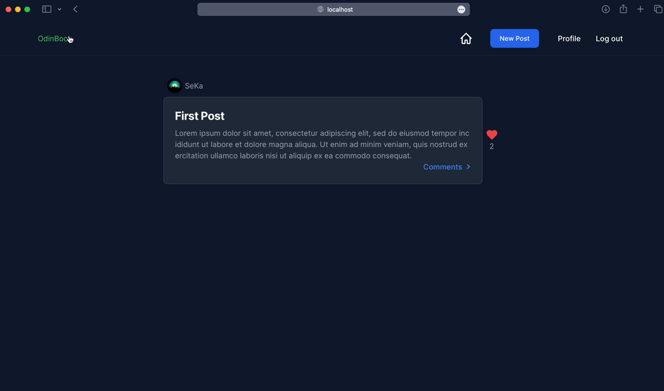

<h2 align="center"><u>Odinbook</u></h2>



<p align="center">
<br>
</p>


## Table of Contents
+ [Overview](#overview)
+ [Features](#features)
+ [How it's made](#how_its_made)
+ [Things to improve](#things_to_improve)


## 📖 Overview <a name = "overview"></a>

Welcome to Odinbook! This is a web application built with Ruby on Rails that provides users with a platform to share and interact with posts, as well as connect with other users. The application includes features such as creating posts, commenting, and following other users.


## 🚀 Features <a name = "features"></a>

- **User Authentication:** Users can sign up, log in, and log out securely using Devise for authentication.
- **Profile Page:** Each user has a dedicated profile page displaying their posts and providing options to view followers, following, and more.
- **Post Creation and Interaction:** Users can create new posts, comment on posts, and like posts.
- **Follow/Unfollow:** Users can follow and unfollow other users to stay updated on their activities.


## 🛠️ How it's made <a name = "how_its_made"></a>

### Technologies Used

- **Ruby on Rails:** The application is built using the Ruby programming language and the Rails framework for web development
- **Database:** PostgreSQL is used as the relational database management system to store and retrieve data efficiently.
- **User Authentication:** Devise gem is employed for secure user authentication, providing features such as sign-up, login, and password recovery.
- **Frontend Styling:** The frontend is styled using HTML, CSS (TailwindCSS).

### Project Structure

The application follows the Model-View-Controller (MVC) architecture, with key components organized as follows:

- **Models:** Ruby classes that define the data structure and interact with the database.
- **Views:** HTML templates responsible for presenting the data to users.
- **Controllers:** Ruby classes that handle the application's logic and orchestrate communication between models and views.
- **Routes:** Defined in the ```config/routes.rb``` file, routes map incoming requests to the appropriate controller actions.


## 🚧 Future Improvements <a name = "future_improvements"></a>

### 1. Private Accounts and Follow Requests

Enable users to set their accounts to private, requiring other users to send follow requests. Implement a system where users can approve or deny follow requests.

### 2. Custom Home and World Feeds

Create a personalized home page that displays posts from users the current user is following. Additionally, implement a 'world' page to showcase all public posts for users to explore.

### 3. Sorting and Filtering

Enhance user experience by adding sorting and filtering options for posts and comments. Allow users to sort posts by likes or time and filter posts based on different criteria.

### 4. Navigation Enhancements

Improve navigation by adding breadcrumbs or a top navigation bar to facilitate easy navigation back to previous pages or jump to specific sections.

### 5. OAuth Integration

Implement OAuth authentication to allow users to sign up or log in using popular platforms such as GitHub or Google, providing a more convenient registration process.

### 6. Integration of Hotwire / Stimulus / Turbo

Incorporate Hotwire, Stimulus, or Turbo to enhance the app's interactivity. Utilize features like Turbo Streams to update parts of the page dynamically, reducing the need for full page refreshes.

### 7. Profile Customization

Enable users to upload their own profile pictures, providing a more personalized and engaging user experience.

### 8. Image Uploads

Extend the application's capabilities by allowing users to post images. This could involve integrating image upload functionality for posts and user avatars.

### 9. Comment Replies

Enhance the commenting system by allowing users to reply to comments. Implement threaded or nested comments for more organized and engaging discussions.

### 10. Testing

Introduce testing frameworks such as RSpec to ensure the robustness and reliability of the application. Write unit tests, integration tests, and system tests to cover critical functionality.

### 11. Lazy Loading for Posts and Comments

Implement lazy loading for posts and comments to optimize page performance. Load an initial set of posts and comments, and dynamically fetch additional content as the user scrolls down or requests more data. This approach ensures a faster initial page load and a smoother user experience while navigating through posts and comments. Consider incorporating technologies like infinite scroll or pagination to manage the loading of content efficiently.

### 12. Code Refactoring for DRYness and Readability

Evaluate the existing codebase and identify opportunities for refactoring to adhere to the "Don't Repeat Yourself" (DRY) principle. Streamline and consolidate repetitive code sections, making the codebase more maintainable and improving overall readability. Consider adding more view partials to modularize and reuse components across different views, promoting a more organized and comprehensible structure.
